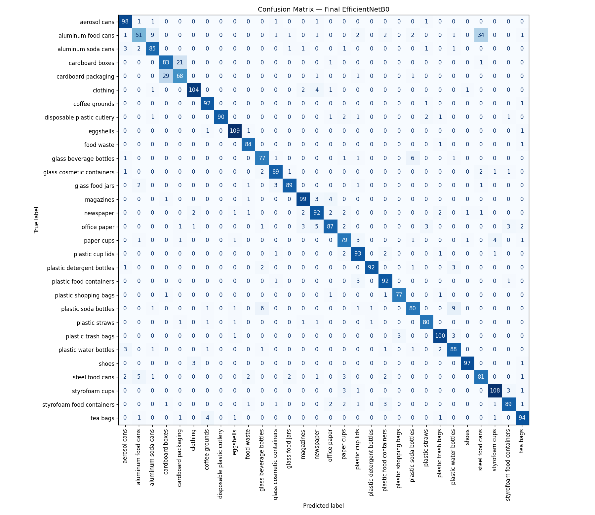

# Waste Classification CNN - EfficientNetB0 Transfer Learning

A deep learning pipeline that classifies household waste into **30 categories** from images, achieving **87.23% top-1 accuracy** and **95.93% top-2 accuracy**.



## Results

| Metric | Value |
|---|---|
| **Top-1 Accuracy** | **87.23%** |
| **Top-2 Accuracy** | **95.93%** |
| **Top-3 Accuracy** | **97.87%** |
| **Macro F1** | 0.882 |
| **Weighted F1** | 0.881 |
| **Model Size** | 28.26 MB |
| **Inference** | ~30 ms/image (T4 GPU) |

The +8.7% gap between top-1 and top-2 accuracy is a strong signal of fine-grained classification: when the model errors, it is usually a near-tie between two visually similar material classes (e.g., aluminum food cans vs. steel food cans).

### Training Progression

| Phase | Strategy | Val Accuracy |
|---|---|---|
| Baseline | From-scratch CNN | ~3% (overfit) |
| Phase 1 | EfficientNetB0, frozen base | 82.2% |
| Phase 2 | + Fine-tune top 20 layers (LR=1e-5) | 87.0% |
| Phase 3 | + Fine-tune top 40 layers (LR=5e-6) | **87.23%** |

## Dataset

- **Source:** [Recyclable and Household Waste Classification (Kaggle)](https://www.kaggle.com/datasets/alistairking/recyclable-and-household-waste-classification)
- **Size:** 15,000 images (500 per class x 30 classes)
- **Split:** 12,000 train / 3,000 validation
- **Classes:** aerosol cans, aluminum cans, cardboard, coffee grounds, eggshells, glass bottles, plastic bottles, ... (30 total)

## Architecture

```
Input (224x224x3)
    |
Data Augmentation (flip, rotate, zoom, contrast)
    |
EfficientNetB0 (ImageNet pretrained, top layers fine-tuned)
    |
GlobalAveragePooling2D
    |
Dropout(0.3)
    |
Dense(30, softmax)
```

**Why this design:**
- **Transfer learning** from ImageNet - reduced training time from days to hours and improved accuracy by ~78% over the baseline
- **GlobalAveragePooling** instead of Flatten - cut parameters from 3.2M to 38K in the head
- **Progressive fine-tuning** - unfroze more base layers with decreasing learning rates

## Per-Class Performance Highlights

**Best classes (F1 >= 0.95):**
- shoes (0.965), eggshells (0.960), plastic shopping bags (0.957), plastic detergent bottles (0.953), disposable plastic cutlery (0.952)

**Weakest classes (F1 < 0.75):**
- aluminum food cans (0.604) - confused with steel food cans
- cardboard packaging (0.705) - confused with cardboard boxes
- steel food cans (0.736) - over-predicted

**Key finding:** Remaining errors concentrate on material-ambiguous pairs (aluminum vs. steel cans, cardboard boxes vs. packaging). These are visually indistinguishable without tactile sensing - a physical limit of the image modality, not a modeling flaw.

## Quick Start

```bash
git clone https://github.com/yourusername/waste-classification-cnn.git
cd waste-classification-cnn
pip install -r requirements.txt
python predict.py --image path/to/waste.jpg
```

### Inference Example

```python
import tensorflow as tf
import numpy as np
from tensorflow.keras.utils import load_img, img_to_array
import json

model = tf.keras.models.load_model('final_model.keras')
with open('class_names.json') as f:
    class_names = json.load(f)

img = load_img('waste.jpg', target_size=(224, 224))
arr = np.expand_dims(img_to_array(img), axis=0)

pred = model.predict(arr, verbose=0)[0]
top3 = np.argsort(pred)[-3:][::-1]

for i in top3:
    print(class_names[i], pred[i] * 100)
```

## Repository Structure

```
waste-classification-cnn/
  README.md
  requirements.txt
  notebooks/
    WASTE_CLASSIFICATION_CNN.ipynb
  src/
    train.py
    predict.py
    evaluate.py
  models/
    final_model.keras
    model_quantized.tflite
    class_names.json
  artifacts/
    confusion_matrix.png
    classification_report.txt
    top_k_accuracy.json
    metadata.json
  demo/
    app.py
```

## Requirements

```
tensorflow>=2.15
numpy
matplotlib
scikit-learn
gradio>=4.0
kagglehub
pillow
```

## Acknowledgments

- Dataset: Alistair King (Kaggle)
- Base model: EfficientNetB0 (Tan & Le, 2019)
- Framework: TensorFlow / Keras

## License

MIT License